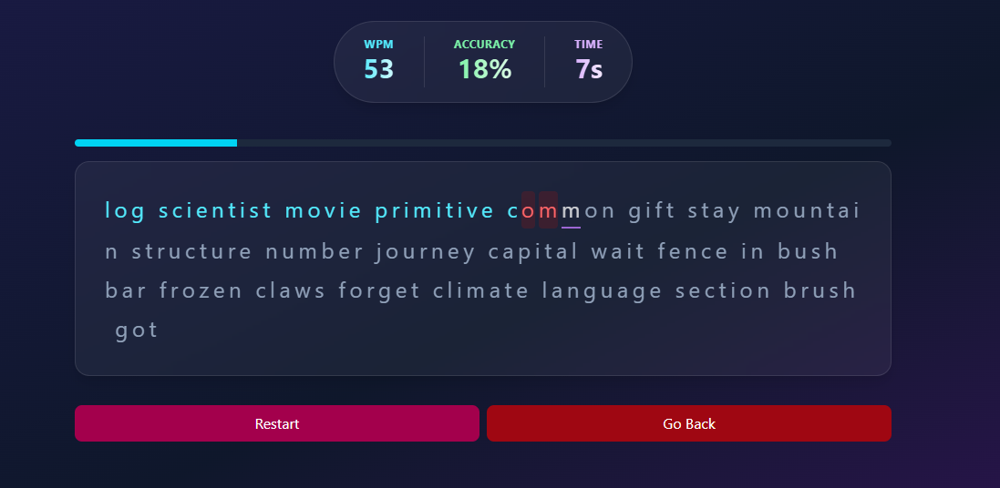

# Taplytics

Taplytics is a simple, elegant, and modern typing test application built with Next.js and React. It allows users to test their typing speed and accuracy in two modes: word-based and quote-based tests. It also tracks performance statistics over time and displays progress charts.

## Preview




## Features

- **Two Modes:** Words and Quotes
- **Real-Time Performance Metrics:** Words Per Minute (WPM), Accuracy, and Time
- **Visual Feedback:** Live progress bar for tracking typing progress
- **Persistent Stats:** Local storage keeps your history across tests
- **Data Visualization:** Charts with trend lines for WPM and Accuracy

## Technologies Used

- **React / Next.js**
- **TypeScript**
- **Tailwind CSS**
- **Chart.js**
- **Random Words and Quotable API** for test content

## Getting Started

### Prerequisites

- [Node.js](https://nodejs.org/) (Version 20+ recommended)
- npm or yarn

### Installation

1. **Clone the repository:**

   ```bash
   git clone https://github.com/unloopedmido/taplytics.git
   cd taplytics
   ```

2. **Install dependencies:**

   ```bash
   npm install
   # or
   yarn install
   ```

3. **Run the development server:**

   ```bash
   npm run dev
   # or
   yarn dev
   ```

   The app will be available at [http://localhost:3000](http://localhost:3000).

## Deployment

To build the project for production, run:

```bash
npm run build
npm run start
```

## Contributing

Contributions are welcome! Please open an issue first to discuss your ideas, or submit a pull request directly.

## License

This project is licensed under the MIT License. See the [LICENSE](LICENSE) file for details.

## Acknowledgements

- [Quotable API](https://github.com/lukePeavey/quotable) - Provides inspirational quotes.
- [Random Words](https://www.npmjs.com/package/random-words) - Generates random words for testing.
- Tailwind CSS - For the modern, responsive design.
